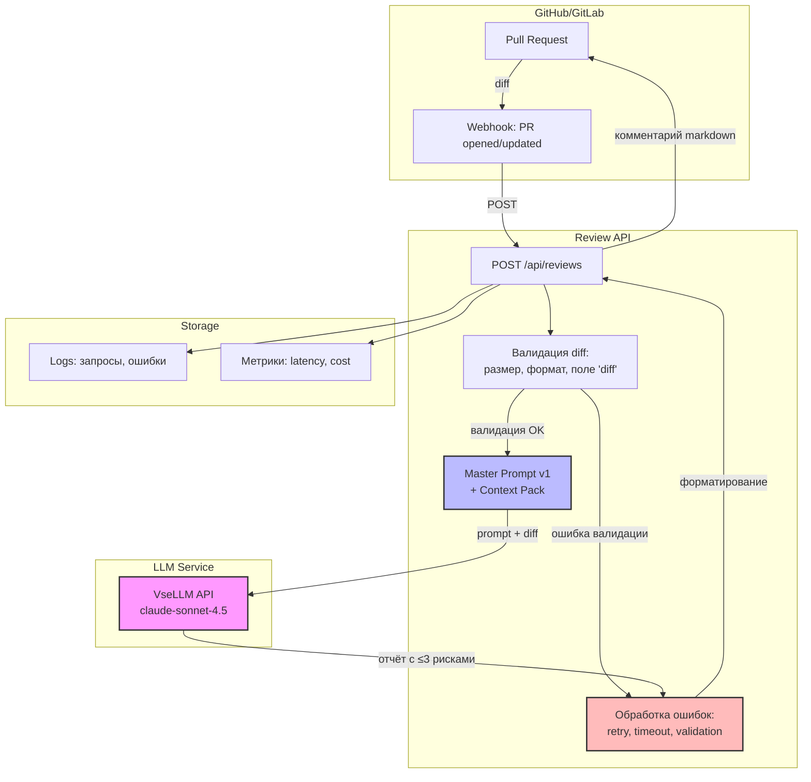

# ADR: решение для первого рабочего сценария

Файл ведёт OpenCode. Обсудите с агентом содержание и проверьте предложенный diff. Все дополнения и исправления поручайте агенту в чате.

- Статус: accepted
- Дата: 2026-09-19 (учебный кейс)
- Ответственные: Команда разработки (учебный проект Практики 1)

## Контекст

**Проблема:** Ревьюеры кода тратят 10-30 минут на поиск типичных проблем (отсутствие валидации входов, обработки ошибок, небезопасный код), которые можно автоматизировать. Высокая когнитивная нагрузка, риск пропустить критичные баги из-за усталости или объёма изменений. ([problem.md](problem.md))

**Требования:**
- Помощник должен анализировать diff PR и находить типичные проблемы автоматически
- Отчёт должен содержать не более трёх рисков с файлом, строкой, описанием, доказательством из diff и воспроизводимой проверкой ([context.md](context.md))
- Помощник НЕ может approve, merge или менять код — решение всегда принимает человек
- Время анализа: <1 минута для diff размером до 1MB
- Интеграция с GitHub/GitLab через webhook

**Ограничения:**
- Доступ к LLM API (VseLLM или аналог)
- Бюджет на LLM-запросы: неизвестен (для учебного кейса — не критично)
- Команда: 1-2 инженера для MVP
- Срок: 2-3 недели для MVP (инкременты 1-2, [project_management.md](project_management.md))
## Решение

**Архитектура:** FastAPI-сервис (Review API) + LLM (VseLLM или OpenAI-compatible API) + GitHub/GitLab webhook integration

**Компоненты:**
1. **Review API (FastAPI):**
   - Endpoint POST /api/reviews принимает payload с diff
   - Валидация: проверка наличия поля "diff", размер diff ≤1MB, формат unified diff
   - Вызов LLM: передача master prompt + diff в LLM SDK
   - Валидация ответа LLM: проверка формата (≤3 риска, каждый с файлом/строкой/доказательством/проверкой)
   - Обработка ошибок: retry при таймауте LLM, возврат понятной ошибки клиенту

2. **LLM Integration:**
   - SDK: `@ai-sdk/openai-compatible` (из opencode.json)
   - Master Prompt: из [prompts.md](prompts.md), секция Master Prompt v1
   - Модель: vsellm/anthropic/claude-sonnet-4.5 (из результатов P1-02)
   - Timeout: 30 секунд на запрос

3. **GitHub/GitLab Integration:**
   - Webhook: PR opened / PR updated → POST /api/reviews с diff
   - GitHub App или GitLab Integration: права на чтение PR и запись комментариев
   - Комментарий: отчёт помощника (markdown) с рисками или "No critical issues found"

**Технологический стек:**
- Backend: Python 3.11+, FastAPI, Pydantic (для валидации payload)
- LLM SDK: AI SDK (OpenAI-compatible)
- Deployment: Docker + Kubernetes или cloud functions (GCP Cloud Run, AWS Lambda)
- CI/CD: GitHub Actions или GitLab CI

**Безопасность:**
- API key LLM хранится в secrets (не в коде)
- Webhook signature validation (HMAC) для GitHub/GitLab
- Rate limiting: 10 запросов/минуту на endpoint (защита от DoS)
- Логирование: запросы и ошибки без включения секретов
## Рассмотренные альтернативы

| Альтернатива | Почему не выбрали сейчас |
|---|---|
| GitHub Copilot или статические анализаторы (SonarQube, Semgrep) | Статические анализаторы находят синтаксические ошибки и паттерны, но не контекстуальные проблемы (например, отсутствие валидации для конкретного endpoint). GitHub Copilot — IDE-интеграция, не подходит для автоматизации в CI/CD. Мы используем LLM для контекстуального анализа. |
| Self-hosted LLM (Llama, Mistral) | Требует GPU-инфраструктуры, DevOps-ресурсов для поддержки, больше времени на setup. Для MVP используем cloud LLM API (VseLLM). Self-hosted можно рассмотреть позже для снижения стоимости. |
| Интеграция напрямую в GitHub Actions/GitLab CI без отдельного API | Проще для MVP, но сложнее масштабировать (каждый workflow повторяет логику). Отдельный API позволяет переиспользовать логику для разных проектов и провайдеров (GitHub, GitLab, Bitbucket). |
| Fine-tuned модель для code review | Требует датасет (размеченные PR с проблемами), GPU для обучения, maintenance. Для MVP используем pretrained LLM с master prompt. Fine-tuning можно рассмотреть после сбора данных о качестве отчётов. |

## Последствия и главный риск

- Положительные последствия:
  - Ревьюеры тратят меньше времени на поиск типичных проблем (цель: снижение на 20-30%, [problem.md](problem.md))
  - Единообразие проверок: все PR проходят через единый master prompt
  - Ревьюеры могут сфокусироваться на архитектуре и бизнес-логике
  - Снижение риска пропустить критичные баги из-за усталости

- Ограничения:
  - Зависимость от доступности LLM API (если API недоступен, ревью идёт вручную)
  - Стоимость LLM-запросов растёт с количеством PR (нужен мониторинг бюджета)
  - Помощник не заменяет ревьюера: решение всегда принимает человек
  - Качество отчётов зависит от master prompt (требуется итеративная доработка)

- Главный риск: **Ложные срабатывания (false positives) или пропуск критичных проблем (false negatives) снижают доверие ревьюеров к помощнику**
  - Если помощник часто находит "проблемы", которые не являются проблемами, ревьюеры перестанут читать отчёты
  - Если помощник пропускает очевидные проблемы, ревьюеры не будут полагаться на него

- Как проверим риск:
  - Метрика: доля отчётов, с которыми ревьюер согласился (accept rate). Цель: ≥70% рисков из отчётов приводят к комментариям ревьюера
  - Сбор фидбека: в комментарии помощника добавить кнопки 👍/👎 для ревьюера
  - A/B тест: сравнить качество ревью (количество пропущенных багов после merge) для PR с помощником и без
  - Ретроспектива через 2 недели: опросить ревьюеров о качестве отчётов и внести правки в master prompt

## Архитектурная схема

## Как использовали AI

- Для чего: Заполнение adr.md — архитектурное решение для AI-помощника code review, выбор стека, альтернативы, риски, архитектурная схема Mermaid
- Тип промпта: zero-shot (агент OpenCode в режиме Build)
- Строка в [`prompts.md`](prompts.md): (домашняя работа, не отдельный запуск)
- Что проверил студент и какие исправления поручил агенту: Проверить согласованность решения с context.md, problem.md, project_management.md; убедиться что архитектурная схема Mermaid отображается корректно; проверить что альтернативы и риски обоснованы; убедиться что технологический стек соответствует TRAINING_PR.diff (Python, FastAPI)
