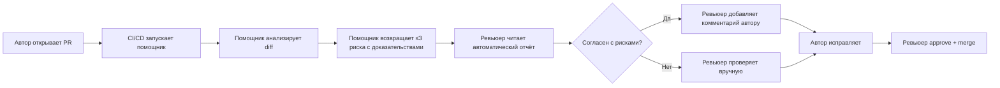

# Анализ процесса: AS IS и TO BE

Файл ведёт OpenCode. Обсудите с агентом содержание и проверьте предложенный diff. Все дополнения и исправления поручайте агенту в чате.

## AS IS

**Участники:**
- Ревьюер кода (человек)
- Автор PR
- CI/CD система (опционально: линтеры, статический анализ)

**Процесс:**
1. Автор открывает PR в GitHub/GitLab
2. Ревьюер получает уведомление
3. Ревьюер вручную читает diff, ищет проблемы: отсутствие валидации входов, обработки ошибок, небезопасный код, ошибки логики
4. Ревьюер пишет комментарии вручную
5. Автор исправляет замечания
6. Ревьюер повторно проверяет изменения
7. Ревьюер approve, автор merge

**Задержки:**
- Ревьюер тратит 10-30 минут на поиск типичных проблем, которые можно автоматизировать
- Ревьюер может пропустить проблему из-за усталости или большого объёма изменений
- Очередь PR растёт, если ревьюеров мало

**Ручные операции:**
- Чтение diff
- Поиск паттернов ошибок (отсутствие валидации, обработки ошибок)
- Написание комментариев с ссылкой на файл, строку, описание проблемы

**Точки потери информации:**
- Ревьюер может забыть проверить edge case
- Нет единого чек-листа проблем для всех PR
- Знания о типичных ошибках не всегда документированы

## TO BE

**Процесс с AI-помощником:**

**Изменения:**
- AI-помощник автоматически анализирует diff при открытии PR
- Помощник возвращает не больше трёх рисков с файлом, строкой, доказательством из diff и воспроизводимой проверкой
- Ревьюер использует отчёт помощника как чек-лист, но решение принимает сам
- Помощник НЕ может approve, merge или менять код

## Разница

| Что меняется | AS IS | TO BE | Как проверим изменение |
|---|---|---|---|
| Время первого фидбека ревьюера | 10-30 минут на поиск типичных проблем вручную | AI-помощник возвращает отчёт за <1 минуту; ревьюер проверяет отчёт за 5-10 минут | Измерить среднее время между открытием PR и первым комментарием ревьюера за неделю ([problem.md](problem.md), метрика 1) |
| Количество пропущенных критичных проблем | Ревьюер может пропустить из-за усталости или объёма | Помощник находит типичные проблемы автоматически, ревьюер проверяет edge case | Измерить долю PR с hotfix/bug-отчётами в течение 7 дней после merge ([problem.md](problem.md), метрика 2) |
| Единообразие проверок | Нет единого чек-листа, зависит от опыта ревьюера | Помощник применяет единый набор правил ко всем PR | Проверить, что формат отчёта помощника одинаков для всех PR (≤3 риска, файл+строка+доказательство+проверка) |
| Роль ревьюера | Ищет типичные проблемы + проверяет логику и архитектуру | Проверяет отчёт помощника + фокусируется на логике и архитектуре | Опросить ревьюеров: изменилось ли распределение времени между поиском типичных проблем и анализом архитектуры |

## Как использовали AI

- Для чего: Заполнение analysis.md — описание AS IS и TO BE процессов code review с AI-помощником, создание BPMN-диаграммы TO BE
- Тип промпта: zero-shot (агент OpenCode в режиме Build)
- Строка в [`prompts.md`](prompts.md): (домашняя работа, не отдельный запуск)
- Что проверил студент и какие исправления поручил агенту: Проверить согласованность с context.md, problem.md; убедиться что диаграмма Mermaid отображается в GitHub; проверить что задержки и ручные операции соответствуют учебному кейсу
