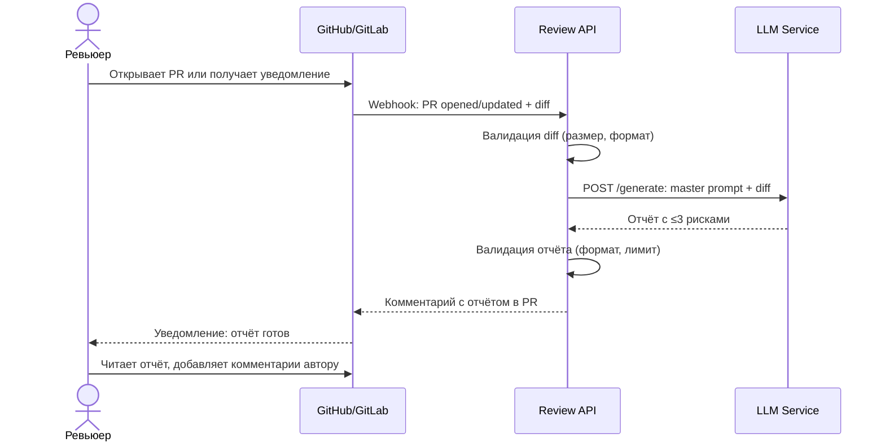

# Use cases и user stories

Файл ведёт OpenCode. Обсудите с агентом содержание и проверьте предложенный diff. Все дополнения и исправления поручайте агенту в чате.

## Первый рабочий сценарий

**Когда** ревьюер получает уведомление о новом PR, **система** автоматически запускает AI-помощника, который анализирует diff и возвращает отчёт с не более чем тремя рисками (каждый с файлом, строкой, описанием проблемы, доказательством из diff и воспроизводимой проверкой), **а пользователь (ревьюер) получает** структурированный отчёт, который помогает быстрее найти типичные проблемы и сфокусироваться на логике и архитектуре.

Не входит в этот сценарий:

- Автоматическое approve или merge PR (решение всегда принимает человек)
- Автоматическое исправление кода (помощник только находит проблемы)
- Анализ архитектурных решений или бизнес-логики (это задача ревьюера)
- Интеграция с issue tracker или project management (только анализ diff)

## Use case

| Поле | Значение |
|---|---|
| Актор | Ревьюер кода (Software Engineer, Tech Lead) |
| Триггер | Открытие нового PR или push нового коммита в существующий PR |
| Предусловия | PR содержит diff в формате unified diff; LLM-сервис доступен; есть конфигурация master prompt для помощника |
| Основной результат | Ревьюер получает структурированный отчёт с не более чем тремя рисками (файл, строка, описание, доказательство из diff, воспроизводимая проверка); ревьюер использует отчёт для комментариев автору PR |
| Ошибка или отказ | LLM-сервис недоступен → ревьюер получает уведомление об ошибке, продолжает ревью вручную; diff слишком большой (>1MB) → помощник возвращает ошибку "diff too large"; diff пустой → помощник возвращает "no changes found" |



## User stories и acceptance criteria

```gherkin
Feature: AI-помощник автоматически находит типичные проблемы в PR

  Scenario: Позитивный — помощник находит KeyError в новом endpoint
    Given PR содержит новый endpoint POST /api/reviews
    And endpoint обращается к payload["diff"] без проверки наличия ключа
    When CI/CD запускает AI-помощника с diff PR
    Then помощник возвращает отчёт с риском "KeyError на payload['diff']"
    And риск содержит файл app/api.py, строку ~10
    And риск содержит доказательство из diff: "return review_service.review(payload['diff'])"
    And риск содержит воспроизводимую проверку: "curl -X POST /api/reviews -d '{}'"
    And отчёт содержит не более трёх рисков

  Scenario: Позитивный — помощник находит отсутствие обработки ошибок LLM
    Given PR содержит вызов self.llm.generate(prompt) без try-except
    When CI/CD запускает AI-помощника с diff PR
    Then помощник возвращает риск "Отсутствие обработки ошибок LLM"
    And риск содержит файл app/review_service.py, строку ~16
    And риск содержит воспроизводимую проверку: сценарий остановки LLM-сервиса

  Scenario: Негативный — diff пустой
    Given PR не содержит изменений (diff пустой)
    When CI/CD запускает AI-помощника
    Then помощник возвращает сообщение "No changes found"
    And отчёт не содержит рисков

  Scenario: Граничный — diff содержит только изменения форматирования
    Given PR содержит только изменения whitespace и formatting
    When CI/CD запускает AI-помощника
    Then помощник возвращает "No critical issues found" или список из 0 рисков
    And ревьюер получает отчёт без рисков

  Scenario: Граничный — diff слишком большой (>1MB)
    Given PR содержит diff размером более 1MB
    When CI/CD запускает AI-помощника
    Then помощник возвращает ошибку "Diff too large (limit: 1MB)"
    And ревьюер получает уведомление об ошибке
    And ревьюер продолжает ревью вручную
```

## Как использовали AI

- Для чего: Заполнение product_management.md — use cases, user stories (Gherkin), сценарии для AI-помощника code review
- Тип промпта: zero-shot (агент OpenCode в режиме Build)
- Строка в [`prompts.md`](prompts.md): (домашняя работа, не отдельный запуск)
- Что проверил студент и какие исправления поручил агенту: Проверить согласованность use case с analysis.md и context.md; убедиться что Gherkin-сценарии покрывают позитивный, негативный и граничные случаи из TRAINING_PR.diff; проверить что sequence diagram отображается корректно
