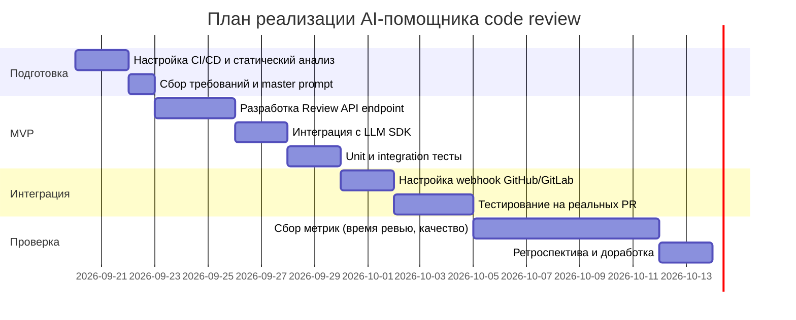

# План поставки

Файл ведёт OpenCode. Обсудите с агентом содержание и проверьте предложенный diff. Все дополнения и исправления поручайте агенту в чате.

## Инкременты и ответственность

| Инкремент | Наблюдаемый результат | Что делает человек | Что делает AI или субагент | Проверка | Зависимости |
|---|---|---|---|---|---|
| 1. Baseline: статический анализ diff | CI/CD pipeline запускает статический анализатор (ruff, mypy) и возвращает отчёт с ошибками типов и линтинга | Инженер настраивает CI/CD конфигурацию (.github/workflows или .gitlab-ci.yml), определяет правила линтера | Статический анализатор (ruff, mypy) проверяет код без LLM | Запустить CI на тестовом PR с известными ошибками; убедиться что отчёт содержит ошибки типов | Нет зависимостей |
| 2. MVP: AI-помощник с фиксированным промптом | POST /api/reviews возвращает отчёт с ≤3 рисками для переданного diff; отчёт содержит файл, строку, описание, curl-проверку | Инженер разрабатывает API endpoint, интегрирует LLM SDK, пишет фиксированный промпт в коде | LLM принимает фиксированный промпт + diff, возвращает JSON с рисками | Отправить TRAINING_PR.diff в POST /api/reviews; проверить что ответ содержит KeyError-риск с app/api.py:~10 и curl-проверкой | Инкремент 1 (CI/CD готов); доступ к LLM API |
| 3. Интеграция с GitHub/GitLab | При открытии PR автоматически создаётся комментарий с отчётом помощника | Инженер настраивает webhook GitHub/GitLab → Review API; добавляет GitHub App или GitLab Integration | Review API получает webhook с diff, вызывает LLM, постит комментарий в PR через GitHub/GitLab API | Открыть тестовый PR; убедиться что комментарий с отчётом появляется автоматически в течение 1 минуты | Инкремент 2 (API работает); GitHub/GitLab API credentials |

## Диаграмма Ганта

**Примечание:** Даты условные для учебного кейса. В реальном проекте длительность зависит от доступности LLM API, объёма команды и приоритетов.

## Как использовали AI

- Для чего: Заполнение project_management.md — инкременты, роли людей/AI, план поставки (Gantt) для AI-помощника code review
- Тип промпта: zero-shot (агент OpenCode в режиме Build)
- Строка в [`prompts.md`](prompts.md): (домашняя работа, не отдельный запуск)
- Что проверил студент и какие исправления поручил агенту: Проверить согласованность инкрементов с use cases из product_management.md; убедиться что роли людей и AI разделены чётко; проверить что Gantt-диаграмма отображается в GitHub; проверить что зависимости между инкрементами корректны
